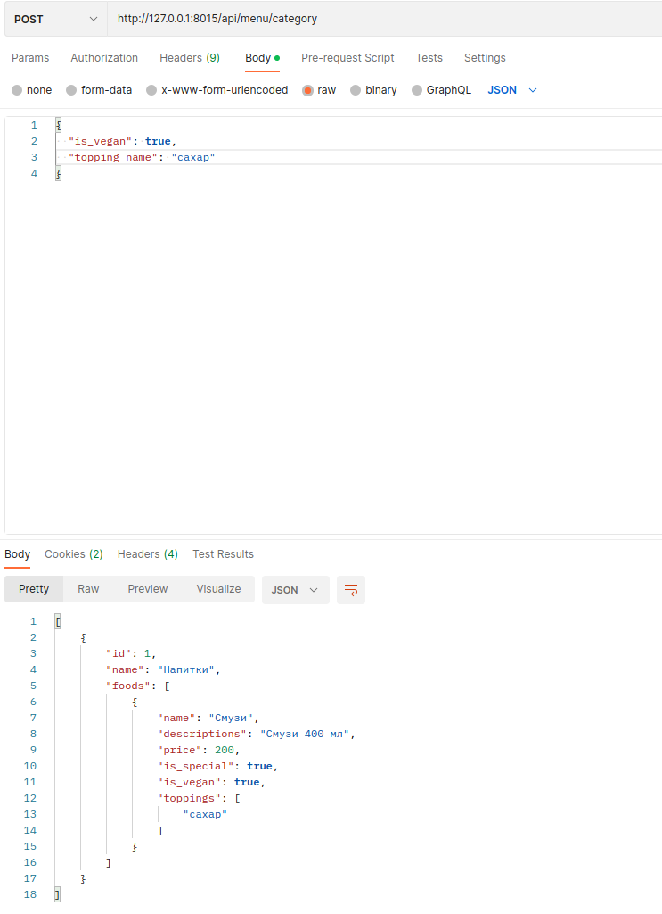
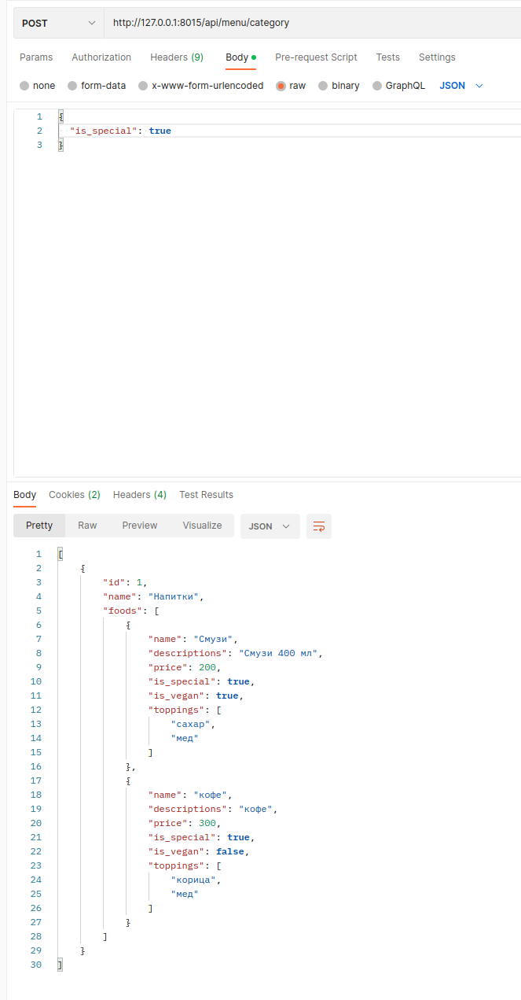

# restaurant_menu
----------------------------------------------------------------

Реализованы множественные группировки фильтрами, максимальная скорость работы приложения достигается асинхронным
фреймворком и всего одним запросом в базу:

----------------------------------------------------------------
ЗАДАНИЕ
Электронное меню для ресторана

Даны сущности "Категория Блюд", "Блюдо" и "Ингредиенты".

Требуется реализовать эндпоинт который вернёт все блюда у которых is_publish=True сгруппированными по категориям,
добавить возможность фильтрации по: is_vegan, is_special, [topping.name, …]

Пример ответа:
[
      {
         "id":1,
         "name":"Напитки",
         "foods":[
            {
               "name": "Смузи",
               "description": "Смузи 400 мл",
	“price”: 200,
               "is_vegan": true,
               "is_special": false,
               "toppings": [ “Киви”, ”Манго” ]
            },
            {...}
         ]
      },
      {
         "id":2, 
         "name":"Выпечка",
         "foods":[...]
      },
]
При выполнении задания необходимо:
Построить грамотную архитектуру проекта
Реализовать работу с БД 
Сделать запрос через любую ORM
Покрыть код тестами
Использовать любой стек технологий.
Результат опубликовать в репозиторий
